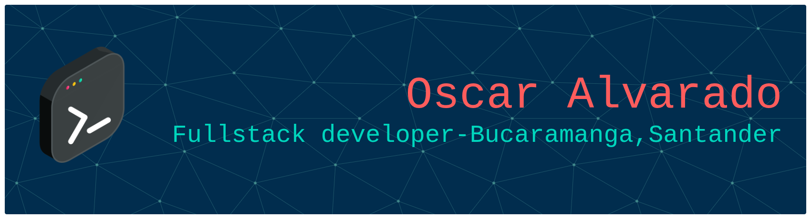

# Bienvenid@ al GitHub de Oscar Alvarado 

<h1> Tecnologias que Domino</h1>
<h3> Bases de Datos</h3>

  	

<h2> Lenguajes de Programación y Frameworks</h2>
<h4> Desarrollo Frontend</h4>

     

<h4> Desarrollo Backend</h4>

       

<h4> Sistemas Operativos</h4>

    

<h4> Otras Tecnologias</h4>

 	  

<h1> Mis redes Sociales</h1>

 

<h1> Mi Trayectoria Academica y Profesional</h1>

Soy un programador con un año de experiencia en la cual se siente atraido por el mundo de la Programación, soy tecnologo en desarrollo de sistemas informaticos de las Unidades Tecnologicas de Santander y actualmente curso la Ingeniería de Sistemas y Computación. Entre mis grandes hobbits aparte de la Programación son las matematicás, Videojuegos, Ciencia y el Ajedrez. Como tal he trabajado en proyectos pequeños para medianas y pequeñas empresas, creando su sistema de ventas para lograr mayor beneficio.

<!--
**OscarF2834/OscarF2834** is a ✨ _special_ ✨ repository because its `README.md` (this file) appears on your GitHub profile.

Here are some ideas to get you started:

- 🔭 I’m currently working on ...
- 🌱 I’m currently learning ...
- 👯 I’m looking to collaborate on ...
- 🤔 I’m looking for help with ...
- 💬 Ask me about ...
- 📫 How to reach me: ...
- 😄 Pronouns: ...
- ⚡ Fun fact: ...
-->
